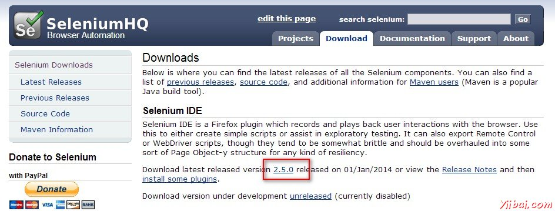
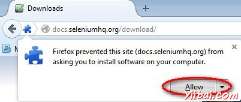
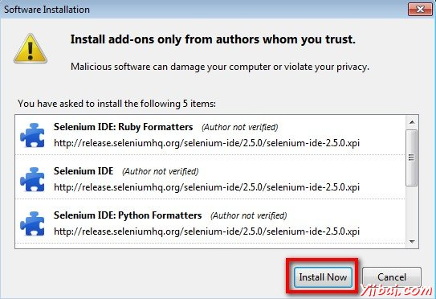
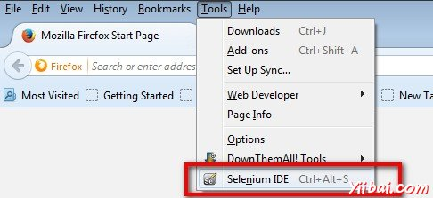

# Selenium IDE下载

## Selenium - IDE

**步骤 1 : **启动Firefox，然后导航到URL - http://seleniumhq.org/download/ （有时打不开，若打不开可能从这里下载：http://www.yiibai.com/siteinfo/download.html）。 在Selenium IDE部分，单击显示如下所示当前版本号的链接。

**步骤 2 :  **Firefox的附加组件通知弹出了允许和禁止的选项。用户必须允许安装。

**步骤3 : **加载项安装程序发出警告不可信的附加组件的用户。点击“Install Now”。

**步骤 4 :  **Selenium IDE现在可以通过浏览访问 'Tools' >> 'Selenium IDE'。

**步骤 5 : **在Selenium IDE，也可以直接从快速访问菜单栏访问，如下图所示。