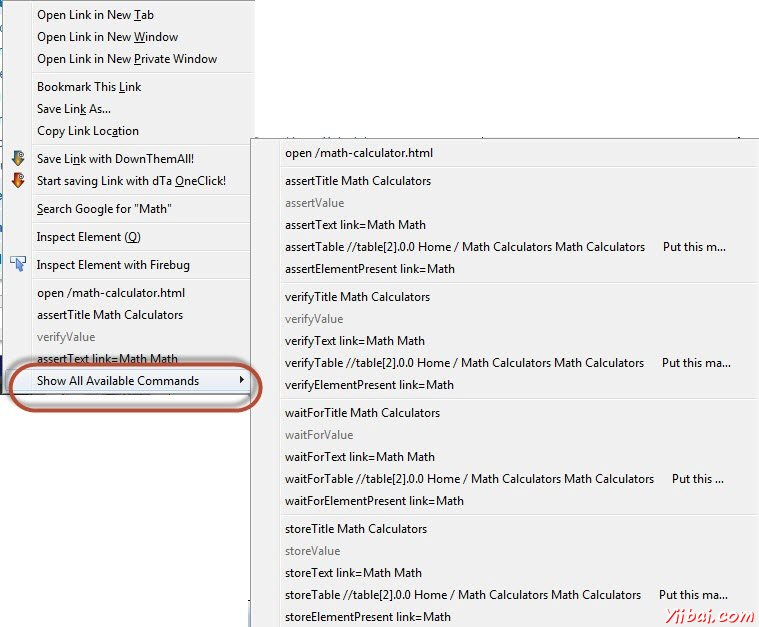

# Selenium IDE验证点

## Selenium IDE验证点

我们还开发了测试用例需要检查一个Web页面的属性。这需要维护和验证命令。有两种方法可以验证点到任何脚本

插入记录模式中的任何验证点单击“右键”元素，并选择“Show all Available Commands”，如下图所示。

我们也可以通过执行“右键”，然后选择“Insert New Command”插入一个命令。

插入新的命令后，单击“Command”下拉列表，选择如下图所示的命令的列表提供适当的验证点

下面是主要用于验证的命令，这有助于我们检查一个特定步骤已通过或失败。

- verifyElementPresent
- assertElementPresent
- verifyElementNotPresent
- assertElementNotPresent
- verifyText
- assertText
- verifyAttribute
- assertAttribute
- verifyChecked
- assertChecked
- verifyAlert
- assertAlert
- verifyTitle
- assertTitle

## 同步点

在程序执行时，应用程序可能由服务器的负载情况来决定响应速度，因此，它必需要应用和脚本同步。下面是几个命令，我们可以用它来确保脚本和应用程序同步。

- waitForAlertNotPresent
- waitForAlertPresent
- waitForElementPresent
- waitForElementNotPresent
- waitForTextPresent
- waitForTextNotPresent
- waitForPageToLoad
- waitForFrameToLoad