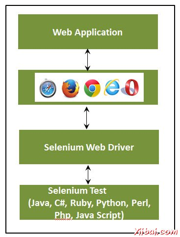
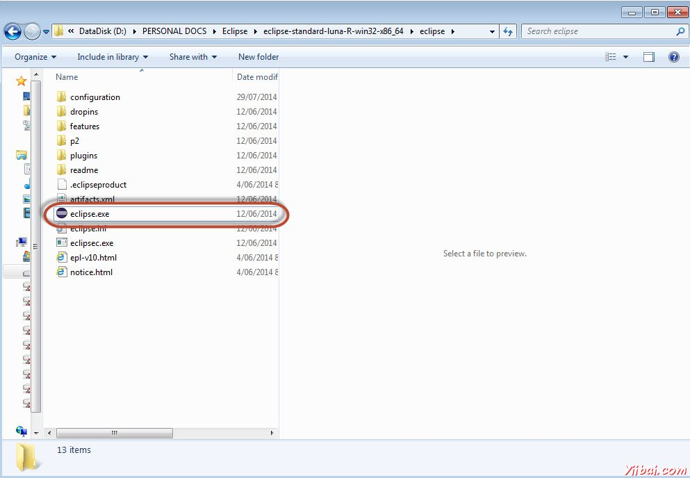
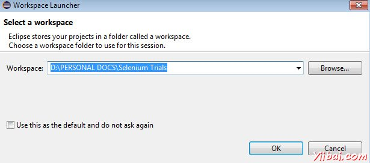
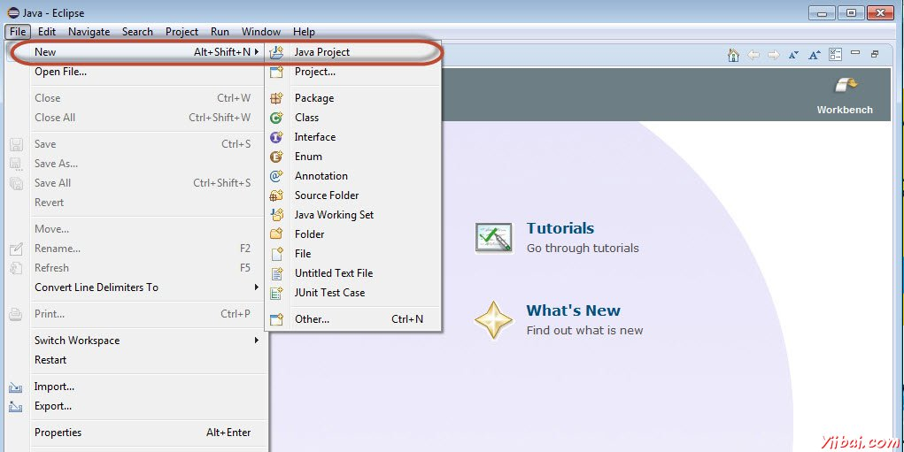
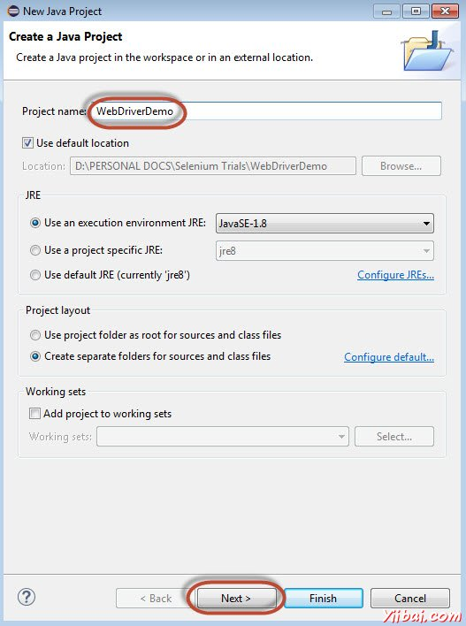
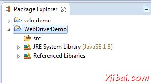
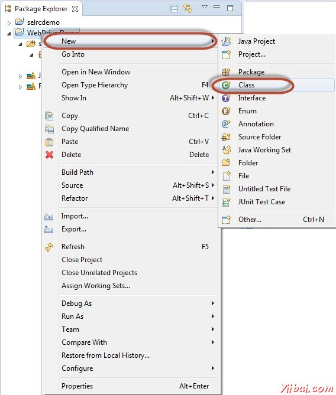
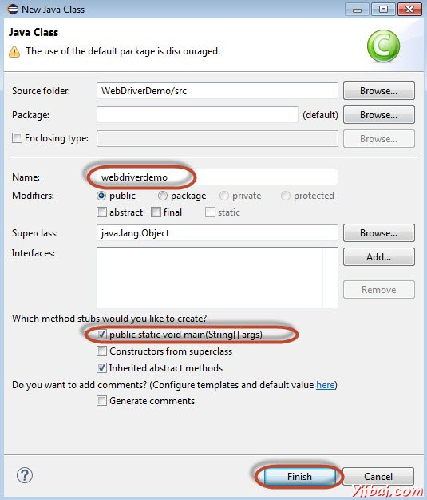
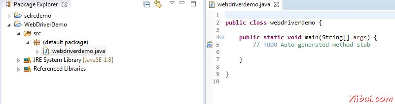
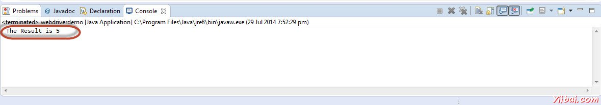

# SeleniumWebdriver

webdriver自动化俗称Selenium 2.0测试Web应用程序工具。 webdriver使用不同的底层框架，Selenium 遥控器使用JavaScript的Selenium 核嵌入式已经在有一定的局限性的浏览器中。 webdriver直接交互而不与Selenium 远程控制，依赖于服务器上的任何中介的浏览器。它是用在以下方面：

在Selenium开发者社区努力下，不断提高Selenium webdriver与Selenium的整合。

- MULT浏览器测试，包括对不能很好地支持Selenium的远程控制浏览器改进的功能(硒1.0)
- 处理多个帧，多个浏览器窗口，弹出窗口和警报。
- 复杂的页面导航。
- 高级用户导航，如拖动和拖放。
- 基于AJAX的UI元素

## 体系结构

webdriver最好用一个简单的架构图，说明，如下图所示。



## Selenium RC VS webdriver

| Selenium RC                              | Selenium WebDriver                       |
| ---------------------------------------- | ---------------------------------------- |
| Selenium RC的结构复杂，因为服务器需要启动在开始试运行前。       | webdriver架构比Selenium RC简单，因为它控制着从操作系统层面的浏览器。 |
| Selenium服务器充当浏览器和Selenese的命令之间的中间人       | webdriver直接相互作用，以在浏览器和使用浏览器的引擎进行控制。      |
| Selenium RC的脚本执行速度较慢，因为它使用了Javascript来与RC互动 | webdriver的速度更快，因为它直接交互使用的浏览器。            |
| Selenium RC不能支持无头，因为它需要一个真正的浏览器一起工作。     | webdriver可以支持无头执行                        |
| 它是一个简单的API                               | 复杂，API相比，RC有点大                           |
| 减面向对象的API                                | 纯粹的面向对象的API                              |
| 不能测试移动应用程序                               | 可测试iPhone/Android应用程序                    |

## 使用webdriver脚本

让我们了解webdriver如何工作。为了演示目的，我们将使用http://www.calculator.net/。我们将执行“百分比计算器”，这是位于“数学计算器”。我们已经下载了所需要webdriver的JAR。请参阅环境设置一章。

第1步：从提取Eclipse文件夹中启动“Eclipse”。



第2步：点击“Browse”按钮选择工作区。



第3步：现在，创建“New Project”，从“File”菜单。



第4步：输入项目名称，然后单击“Next”。



第五步：进入Libraries选项卡，并选中所有的JAR包文件，我们已经下载（请参阅环境搭建章）。添加引用Selenium webdriver的库文件夹中的所有JAR，selenium-java-2.42.2.jar和selenium-java-2.42.2-srcs.jar


第6步：如下图所示创建包。



第7步：现在，让我们创建一个通过执行'Class'右键单击程序包，然后选择“New”>>“Class”



第8步：现在命名类，并让它设置为main方法



第9步：类概要如下所示。



步骤10：现在是时候编写代码了。下面的脚本更容易理解，因为它清楚地解释了一步，在嵌入的注释步骤。请看看“Locators”一章，了解如何捕捉对象的属性。

```java
import java.util.concurrent.TimeUnit;
import org.openqa.selenium.*;
import org.openqa.selenium.firefox.FirefoxDriver;

public class webdriverdemo
{
  public static void main(String[] args)
  {
	WebDriver driver = new FirefoxDriver();

    //Puts a Implicit wait, Will wait for 10 seconds before throwing exception
	driver.manage().timeouts().implicitlyWait(10, TimeUnit.SECONDS);

    //Launch website
	driver.navigate().to("http://www.calculator.net/");
	
	//Maximize the browser
	driver.manage().window().maximize();

    // Click on Math Calculators
	driver.findElement(By.xpath(".//*[@id='menu']/div[3]/a")).click();
  
    // Click on Percent Calculators
	driver.findElement(By.xpath(".//*[@id='menu']/div[4]/div[3]/a")).click();

	// Enter value 10 in the first number of the percent Calculator
    driver.findElement(By.id("cpar1")).sendKeys("10");

    // Enter value 50 in the second number of the percent Calculator
    driver.findElement(By.id("cpar2")).sendKeys("50");
    
    // Click Calculate Button
    driver.findElement(By.xpath(".//*[@id='content']/table/tbody/tr/td[2]/input")).click();

    // Get the Result Text based on its xpath
    String result = driver.findElement(By.xpath(".//*[@id='content']/p[2]/span/font/b")).getText();
    
	//Print a Log In message to the screen
    System.out.println(" The Result is " + result);
    
	//Close the Browser.
    driver.close();    
  }
}

```

第11步：以上脚本的输出将被打印在控制台。



## 最常用的命令

下表列出了webdriver的最常用的命令以及它的语法，这将有助于我们开发webdriver脚本。

| Commmand                                | 描述                                       |
| --------------------------------------- | ---------------------------------------- |
| driver.get("URL")                       | 导航到应用程序                                  |
| element.sendKeys("inputtext")           | 输入一些文本输入框                                |
| element.clear()                         | 从输入框清空内容                                 |
| select.deselectAll()                    | 这将取消选择页面上的第一个选择所有选项：                     |
| select.selectByVisibleText("some text") | select the OPTION with the input specified by the user. |
| driver.switchTo().window("windowName")  | Moving the focus from one window to another |
| driver.switchTo().frame("frameName")    | swing from frame to frame                |
| driver.switchTo().alert()               | Helps in handling alerts                 |
| driver.navigate().to("URL")             | Navigate to the URL                      |
| driver.navigate().forward()             | To Navigate forward                      |
| driver.navigate().back()                | To Navigate back                         |
| driver.close()                          | Closes the current Browser associated with the driver |
| driver.quit()                           | Quits the driver and closes all the associated window of that driver. |
| driver.refresh()                        | Refreshes the current page.              |