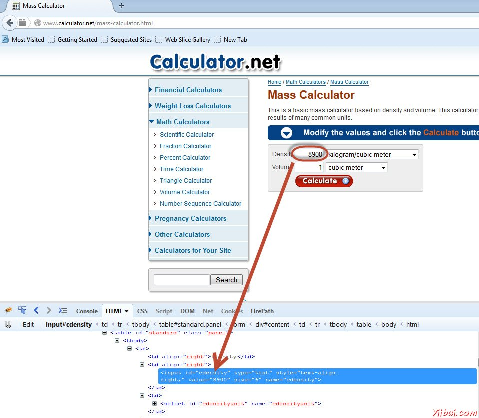
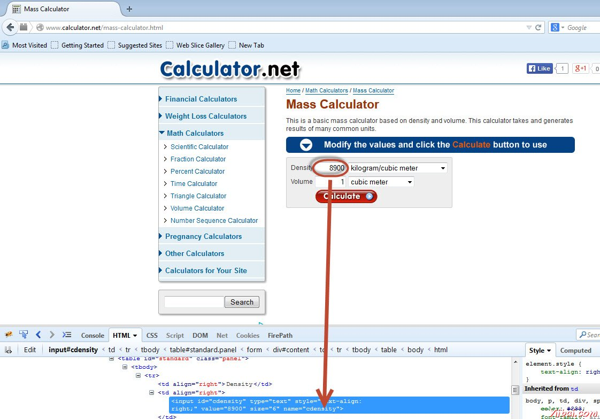
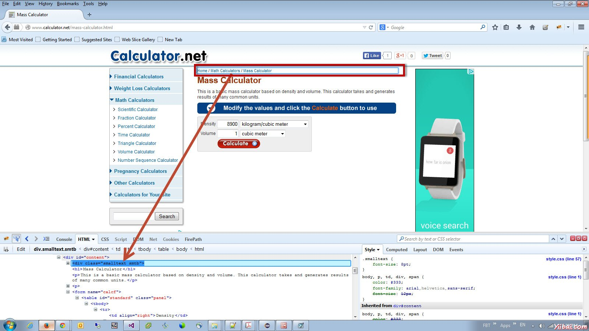
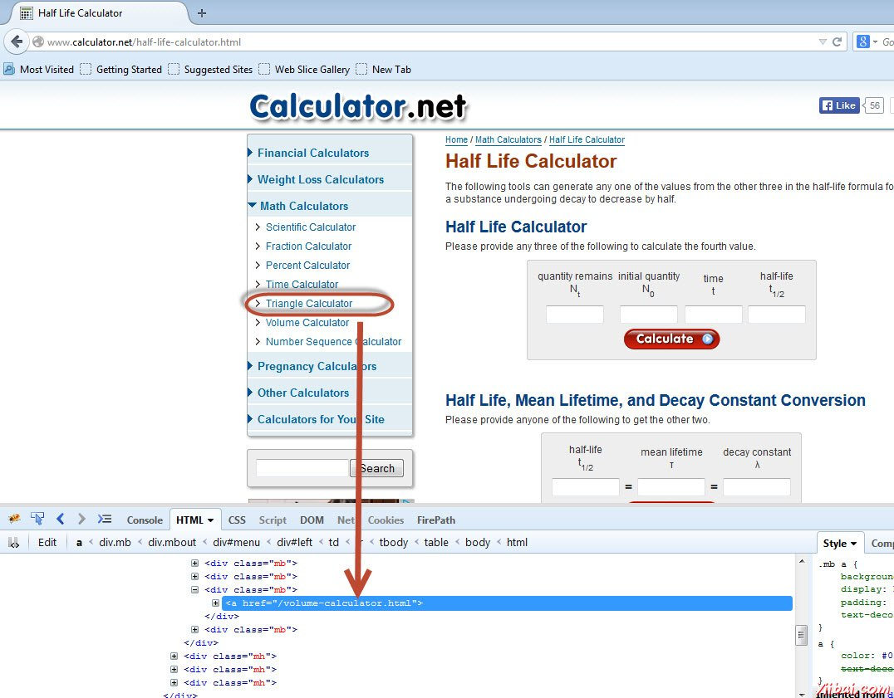
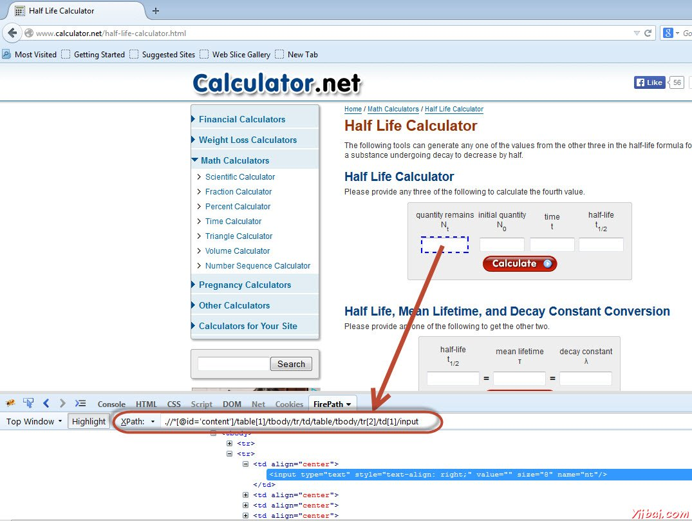

# Selenium定位器

在Selenium 的findElement()和findElements()方法通过webdriver和WebElement类提供的帮助进行webdriver定位元素。

- findElement()方法返回一个基于指定的搜索条件WebElement对象或最终抛出一个异常，如果没有找到符合搜索条件的任何元素。
- findElements()方法返回WebElements符合搜索条件的列表。如果没有发现的元素，则返回空列表。

下表给出了定位selenium 元素的webdriver的Java语法。

| Method               | Syntax                                   | 描述            |
| -------------------- | ---------------------------------------- | ------------- |
| By ID                | driver.findElement(By.id(<element ID>))  | 定位元素使用ID属性    |
| By name              | driver.findElement(By.name(<element name>)) | 定位使用Name属性的元素 |
| By class name        | driver.findElement(By.className(<element class>)) | 定位使用类属性的元素    |
| By tag name          | driver.findElement(By.tagName(<htmltagname>)) | 定位使用HTML标记元素  |
| By link text         | driver.findElement(By.linkText(<linktext>)) | 定位使用的链接文字链接   |
| By partial link text | driver.findElement(By.partialLinkText(<linktext>)) | 定位链接使用链接的文字部分 |
| By CSS               | driver.findElement(By.cssSelector(<css selector>)) | 定位使用CSS选择器的元素 |
| By XPath             | driver.findElement(By.xpath(<xpath>))    | 定位使用XPath查询元素 |

## 定位器的使用

现在让我们了解这些定位器方法每个人的实际使用情况与http://www.calculator.net帮助

1，根据ID：对象访问使用ID的帮助。在这种情况下，它是文本框的ID。该值使用SendKeys方法与ID(cdensity)的帮助下进入文本。



```
driver.findElement(By.id("cdensity")).sendKeys("10");

```

2，按名称：访问对象时使用的名称的帮助。在这种情况下，它是文本框的名称。该值是使用SendKeys方法与ID(cdensity)的帮助下进入文本。



```
driver.findElement(By.name("cdensity")).sendKeys("10");

```

3，通过类名：对象与类的名称，帮助进行访问。在这种情况下，它是WebElement的类名。该值可以用gettext方法进行访问。



```
List<WebElement> byclass = driver.findElements(By.className("smalltext smtb"));

```

4，通过标签名：元素的DOM标签名称，这是很容易处理的表使用此方法。我们可以看一个例子了演示程序。

```
WebElement table = driver.findElement(By.id("calctable"));
List<WebElement> row = table.findElements(By.tagName("tr"));
int rowcount = row.size();

```

5，通过链接文本：此方法可以帮助我们找到与之相配的可见文本的链接元素。



```
driver.findElements(By.linkText("Volume")).click();

```

5，通过部分链接文本：此方法可以帮助我们找到了部分匹配可见文本的链接元素。


```
driver.findElements(By.partialLinkText("Volume")).click();

```

6，使用CSS：CSS的使用作为一种方法来识别网络对象，但不是所有的浏览器支持CSS标识。

```
WebElement loginButton = driver.findElement(By.cssSelector("input.login"));

```

7，通过Xpath：XML表示XML路径语言，是一种查询语言，用于从XML文档中选择节点。 XPath语言是基于XML文档的树表示，并提供选择使用各种标准的节点来浏览周围的树。



```
driver.findElement(By.xpath(".//*[@id='content']/table[1]/tbody/tr/td/table/tbody/tr[2]/td[1]/input")).sendkeys("100");
```