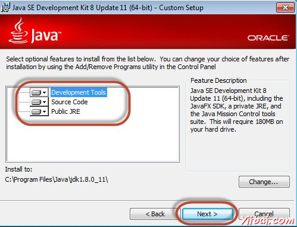
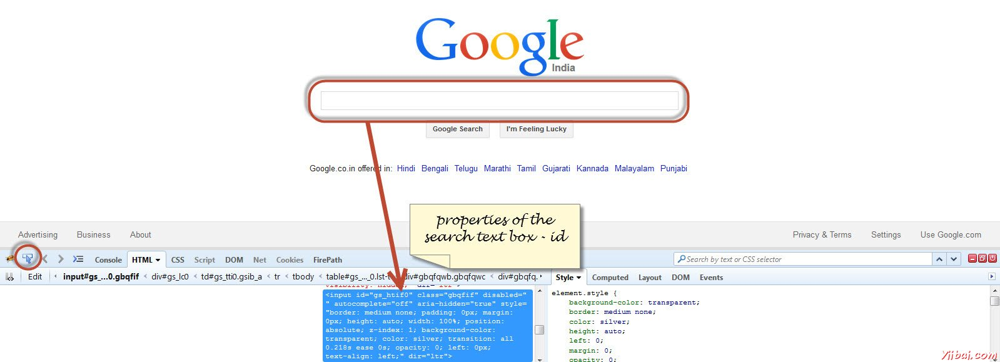

# Selenium环境安装设置

为了开发Selenium RC或webdriver脚本，用户必须确保他们有初始配置完成。有很多关联建立环境的步骤。这里将通过详细的讲解。

- 下载并安装Java
- 下载并配置Eclipse
- 配置Firebug和FirePath
- 配置Selenium RC
- 配置Selenium的webdriver

## 下载并安装Java

我们需要有JDK(Java开发工具包)安装序Selenium Webdriver/Selenium工作。让我们先来看看如何下载和安装Java。

步骤1： 导航到的网址：http://www.oracle.com/technetwork/java/javase/downloads/index.html

步骤2：转到“Downloads”部分，然后选择“JDK Download”。

**步骤3：**选择“Accept License Agreement”单选按钮。

**第4步：**选择合适的安装。在这种情况下它是“Windows 7-64'位。点击相应的链接和exe档案保存到硬盘。

**第5步：**运行下载的exe文件和安装程序向导。点击“Next”继续。

**第6步：**选择功能，然后点击“Next”。

**步骤7：**安装程序提取和相同的进度显示在向导中。

**第8步：**用户可以选择安装位置，然后单击“Next”。

**第9步：**安装程序安装JDK和新的文件将被复制。

**第10步：**安装程序安装成功，并显示给用户。

**步骤11：**要验证是否安装成功，转到命令提示符，然后只需键入Java的一个命令。该命令的输出如下所示。如果Java安装不成功，或者如果它没有安装它会引发“unknown command”的错误。

## 下载并配置Eclipse

第1步：根据操作系统体系结构导航到URL ：http://www.eclipse.org/downloads/ 并下载。

**第2步：**点击“Download”按钮。

**第3步：**下载将是一个压缩格式。解压缩的内容。

**第4步：**找到eclipse.exe并双击该文件。

**第5步：**配置工作区中选择开发位置。

**第6步：**打开如下图所示的Eclipse窗口。

## 配置Firebug和FirePath

要使用Selenium RC或webdriver来工作，我们需要根据自己的XPath或编号或名称等序列，以找出我们需要的工具/插件元素来定位元素。定位元素的各种方式被处理，详细在定位器章节。

步骤1：找到的网址：https://addons.mozilla.org/en-US/firefox/addon/firebug/ 并下载插件。

**步骤2：**将插件安装程序显示给用户，它是在单击“Install”按钮开始安装。

**第3步：**安装完成后，我们可以通过启动插件导航到“Web Developer”>>“Firebug”。

**第4步：**Firepath一个插件，它的工作原理中的萤火虫帮助用户抓住一个元素“Xpath”。导航到“https://addons.mozilla.org/en-US/firefox/addon/firepath/”安装Firepath

**第5步：**插件安装程序显示给用户，它是在单击“Install”按钮开始安装。

**步骤6：**现在推出“Firebug”导航到“Tools”>>“Webdeveloper”>>“Firebug”

### 示例

现在让我们了解如何使用Firebug和firepath一个例子。为了演示目的，我们将使用www.google.com并捕捉“google.com”文本框的属性。

步骤1：首先在下面的截图高亮点击箭头图标，将其拖动到我们想捕捉属性的对象。如下图所示，该对象的HTML / DOM将被显示。我们能够捕捉到的输入文本框的“ID”，我们可以进行交互。

**步骤2：**为了获取对象的XPath，去“firepath”选项卡，然后执行以下步骤。

- 点击间谍图标。
- 选择控制，想要捕捉的XPath
- 将产生的所选择的控制的xpath

## 配置Selenium RC

现在，就让我们来看看如何配置Selenium 的远程控制。我们将了解如何开发在即将到来的章节关于Selenium RC的章节，但是现在我们明白它只是配置的一部分。

第1步：找到selenium 下载部分http://www.seleniumhq.org/download/，并通过点击它的版本号，如下图所示下载Selenium服务器。

**第2步：**下载后，我们需要启动Selenium服务器。这样做，打开命令提示符并导航到下载的JAR文件保持如下所示的文件夹。

**第3步：**启动服务器，使用命令“'java -jar <<downloaded jar name >>"如果已安装Java JDK正常，会得到一个成功的消息，如下图所示。现在，我们就可以开始写这将涉及在下一章Selenium RC的脚本。

## 配置Selenium的webdriver

现在，就让我们来看看如何配置Selenium webdriver。我们将了解如何开发在即将到来的章节，Selenium webdriver的剧本，但是现在我们明白它只是配置的一部分。

**第1步：**找到selenium 下载部分http://www.seleniumhq.org/download/和下载selenium 的webdriver通过点击它的版本号，如下图所示。

**第2步：**下载的文件是压缩格式，一个具有解压缩的内容映射到项目文件夹中。

**步骤3：**如下图所示，将解压缩后的内容将被显示。如何将其映射到项目文件夹，如何启动脚本会处理在webdriver的章节。

