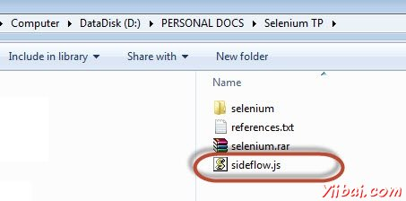
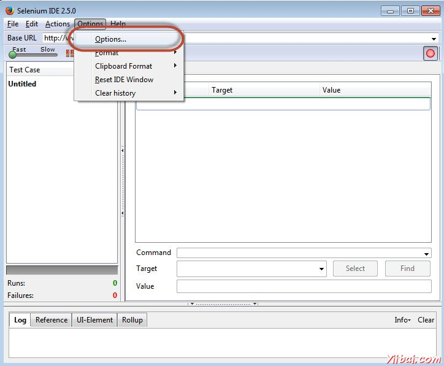
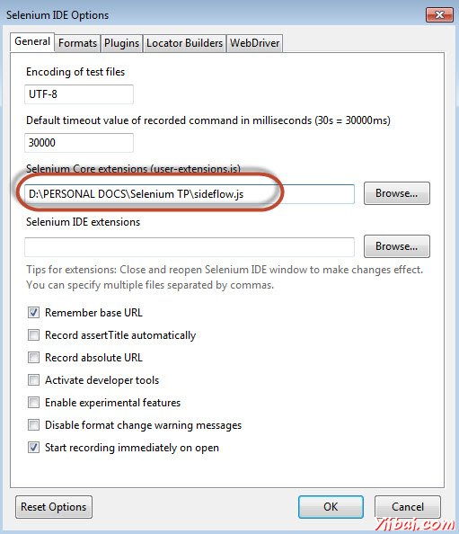
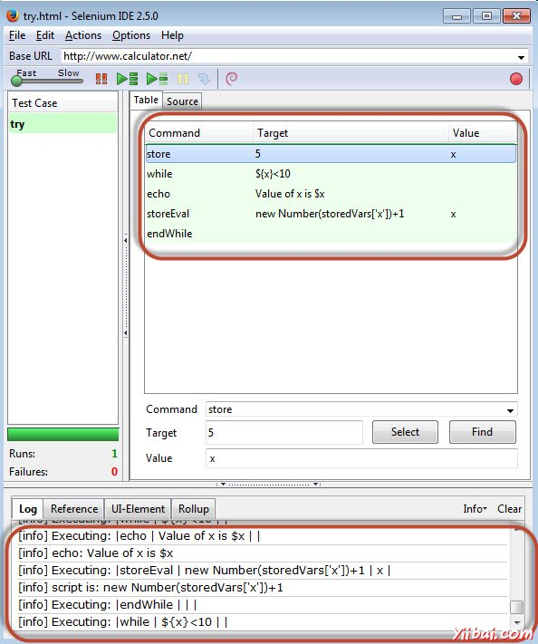

# Selenium用户扩展

## Selenium用户扩展

这很容易扩展Selenium IDE加入自定义操作，断言和定位，策略，这是通过添加方法，在JavaScript的帮助下Selenium 对象原型。在启动时，Selenium会自动寻找通过这些原型方法，使用名称的模式来识别哪些是行动，断言和定位器。

让我们使用JavaScript添加一个'while'循环在Selenium IDE。

**步骤 1 : **要添加js文件，首先导航到https://github.com/darrenderidder/sideflow/blob/master/sideflow.js和复制脚本和地点将其保存在本地文件夹下为 “sideflow.js”，如下图所示。

**第2步：**现在启动“Selenium IDE”，然后导航到"Options" >> "Options"，如下图所示。

**第3步：**点击“Browse”按钮下的“Selenium Core Extensions”区域产并指向我们已经保存在第1步中的js文件。

**第4步：**重新启动Selenium IDE。

**第5步：**现在将有机会获得一些更多的命令，如 "Label" "While"等

**第6步：**现在，我们创造出在Selenium IDE内的循环，这是能够执行的，如下图所示。

