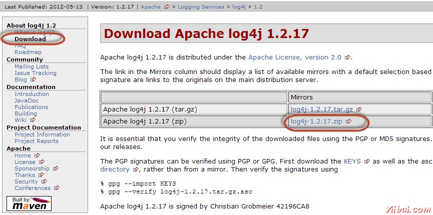
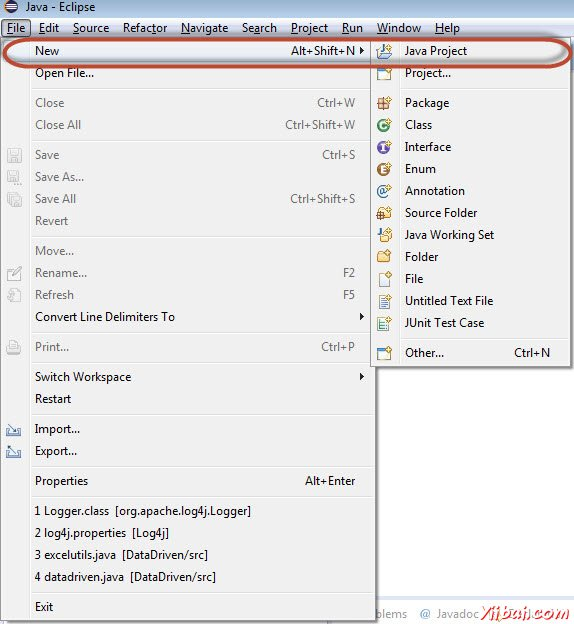
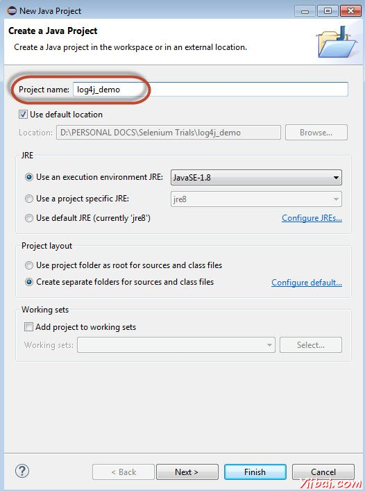
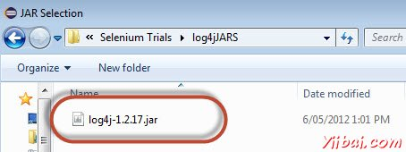
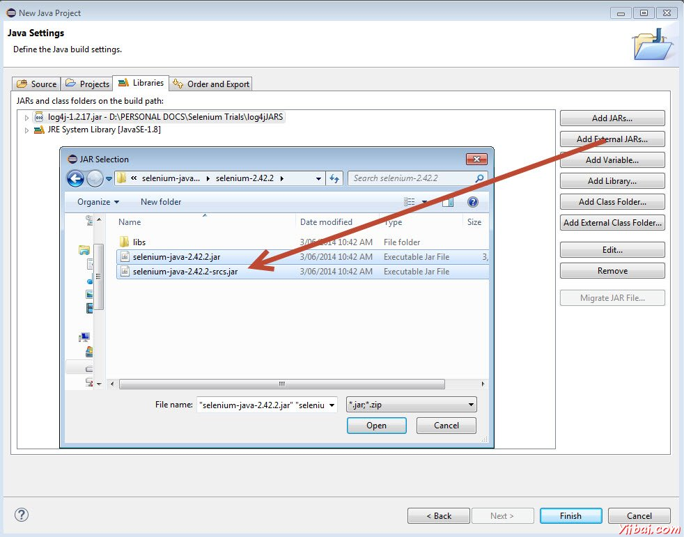
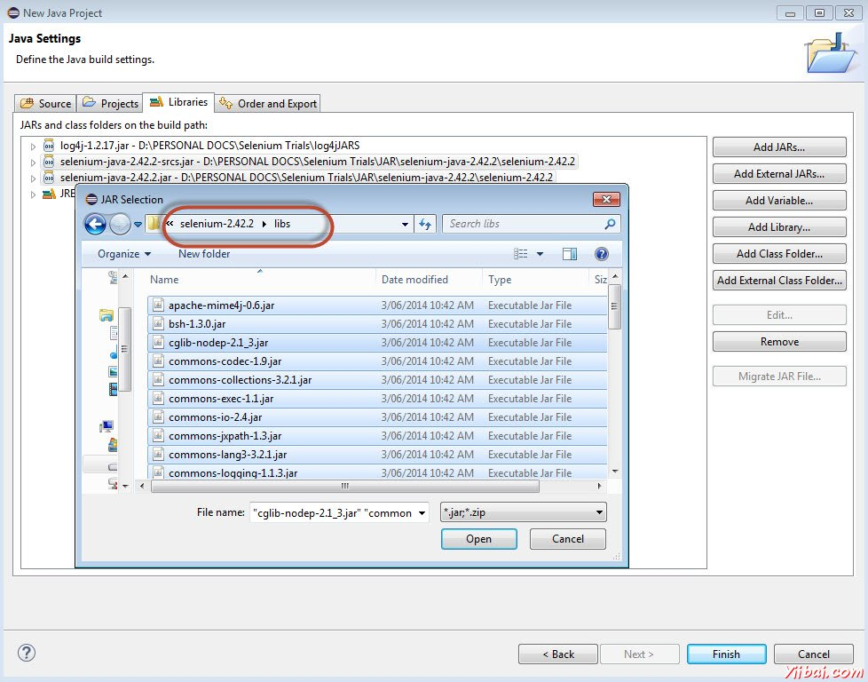
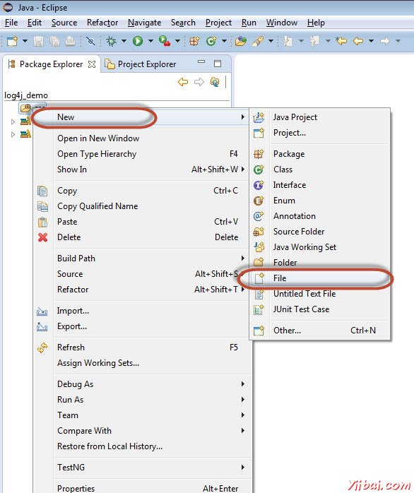
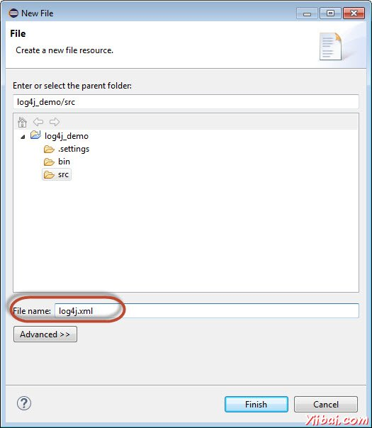
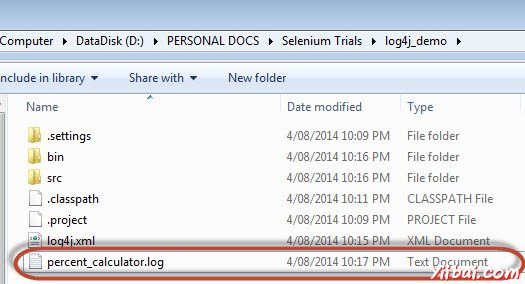
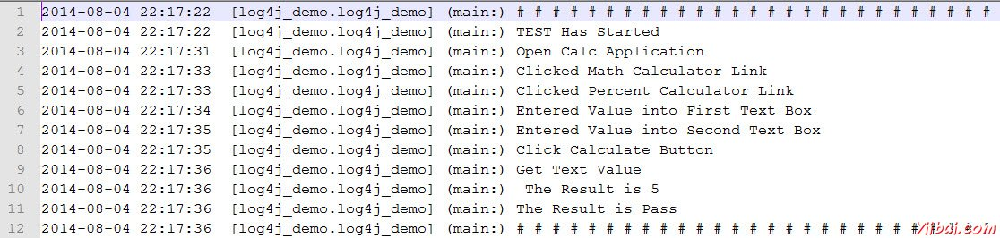

# log4j日志

Log4j是审计日志框架，提供有关执行过程中发生了什么样的信息。它具有以下优点：

- 让我们来了解应用程序运行。
- 日志输出可以保存，可以在以后进行分析。
- 有助于调试，以防自动化测试失败
- 也可用于审计目的看应用的健康。

## 组件

1.Logger类的实例。

2.用于记录该消息为以下之一日志级别的方法

- error
- warn
- info
- debug
- log

## 示例

让我们同样用百分比计算器这个演示。

第1步：从https://logging.apache.org/log4j/1.2/download.htmll下载log4j的JAR文件，并将下载JAR文件的解压缩格式。



第2步：通过浏览到文件菜单中创建'New Java Project'。



**第3步：**输入项目的名称为“log4j_demo”，然后单击“Next”



**第4步：**单击添加外部JAR，并添加“Log4j-1.2.17.jar”



**第5步：**单击添加外部JAR，并添加Selenium webdriver的类库。



**第6步：**单击添加外部JAR，并添加Selenium webdriver的JAR文件的位于libs文件夹中。



**第7步：**使用它我们可以指定Log4j的属性添加一个新的XML文件。



**第8步：**输入日志文件的名称为“log4j.xml”。



**第9步：**下面的最终文件夹结构如下所示。

**第10步：**现在增加Log4j 这将被记录执行过程中的性能。

```xml
<?xml version="1.0" encoding="UTF-8"?>
<!DOCTYPE log4j:configuration SYSTEM "log4j.dtd">
<log4j:configuration xmlns:log4j="http://jakarta.apache.org/log4j/" debug="false">
	<appender name="fileAppender" class="org.apache.log4j.FileAppender">
		<param name="Threshold" value="INFO" />
		<param name="File" value="percent_calculator.log"/>
			<layout class="org.apache.log4j.PatternLayout">
				<param name="ConversionPattern" value="%d{yyyy-MM-dd HH:mm:ss}  [%c] (%t:%x) %m%n" />
			</layout>
	</appender>
	<root>
		<level value="INFO"/>
		<appender-ref ref="fileAppender"/>
	</root>
</log4j:configuration>

```

**第11步：**现在用于演示的目的，我们将结合log4j在相同的测试，我们已经完成（百分比计算器）。添加一个类文件“Main”方法功能

```java
package log4j_demo;
import org.apache.log4j.LogManager;
import org.apache.log4j.Logger;
import org.apache.log4j.xml.DOMConfigurator;

import java.util.concurrent.TimeUnit;
import org.openqa.selenium.*;
import org.openqa.selenium.firefox.FirefoxDriver;


public class log4j_demo 
{
	
  static final Logger logger = LogManager.getLogger(log4j_demo.class.getName());
  public static void main(String[] args) 
  {

	DOMConfigurator.configure("log4j.xml");

	logger.info("# # # # # # # # # # # # # # # # # # # # # # # # # # # ");
	logger.info("TEST Has Started");
	
	WebDriver driver = new FirefoxDriver();

	//Puts a Implicit wait, Will wait for 10 seconds before throwing exception
	driver.manage().timeouts().implicitlyWait(10, TimeUnit.SECONDS);

	//Launch website
	driver.navigate().to("http://www.calculator.net/"); logger.info("Open Calc Application");
	
	//Maximize the browser
	driver.manage().window().maximize();

	// Click on Math Calculators
	driver.findElement(By.xpath(".//*[@id='menu']/div[3]/a")).click();  logger.info("Clicked Math Calculator Link");
  
	// Click on Percent Calculators
	driver.findElement(By.xpath(".//*[@id='menu']/div[4]/div[3]/a")).click(); logger.info("Clicked Percent Calculator Link");

	// Enter value 10 in the first number of the percent Calculator
	driver.findElement(By.id("cpar1")).sendKeys("10"); logger.info("Entered Value into First Text Box");


	// Enter value 50 in the second number of the percent Calculator
	driver.findElement(By.id("cpar2")).sendKeys("50");  logger.info("Entered Value into Second Text Box");
	
	// Click Calculate Button
	driver.findElement(By.xpath(".//*[@id='content']/table/tbody/tr/td[2]/input")).click(); logger.info("Click Calculate Button");

	// Get the Result Text based on its xpath
	String result = driver.findElement(By.xpath(".//*[@id='content']/p[2]/span/font/b")).getText();  logger.info("Get Text Value");
	
	//Print a Log In message to the screen
	logger.info(" The Result is " + result);
	
	if(result.equals("5"))
	{
		logger.info("The Result is Pass");

	}
	else
	{
		logger.error("TEST FAILED. NEEDS INVESTIGATION");

	}
	
	logger.info("# # # # # # # # # # # # # # # # # # # # # # # # # # # ");
	
	//Close the Browser.
	driver.close();    
  }
}

```

## 执行

在执行日志文件的根文件夹中创建如下图所示。在Eclipse中不能找出文件。应该打开“Windows资源管理器”来显示相同。



该文件的内容如下所示。


