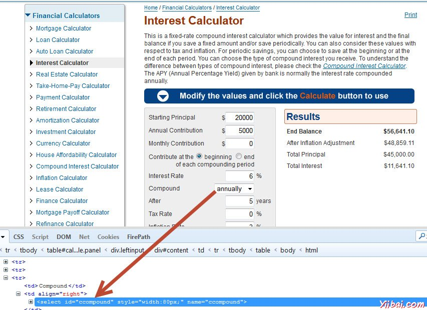
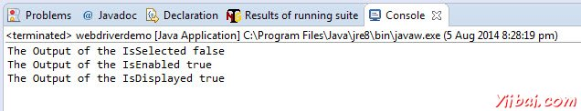

# 下拉框交互

在本节中，我们将了解如何使用下拉框进行交互。我们可以用“selectByVisibleText'或'selectByIndex'或'selectByValue'的方法选择一个选项。

让我们明白，如何使用交互复选框 - http://www.calculator.net/interest-calculator.htmll。我们还可以检查下拉框中选择/启用/可见。



```java
import java.util.concurrent.TimeUnit;

import org.openqa.selenium.*;
import org.openqa.selenium.firefox.FirefoxDriver;
import org.openqa.selenium.support.ui.Select;

public class webdriverdemo
{
  public static void main(String[] args) throws InterruptedException
  {
	WebDriver driver = new FirefoxDriver();

	//Puts a Implicit wait, Will wait for 10 seconds before throwing exception
	driver.manage().timeouts().implicitlyWait(10, TimeUnit.SECONDS);


	//Launch website
	driver.navigate().to("http://www.calculator.net/interest-calculator.htmll");
	driver.manage().window().maximize();
	 
    // Selecting an item from Drop Down list Box
	Select dropdown = new Select(driver.findElement(By.id("ccompound")));
	dropdown.selectByVisibleText("continuously");
	
	//  you can also use dropdown.selectByIndex(1) to select second element as index starts with 0.
	//  You can also use dropdown.selectByValue("annually");    
        
    System.out.println("The Output of the IsSelected " + driver.findElement(By.id("ccompound")).isSelected());
    System.out.println("The Output of the IsEnabled " + driver.findElement(By.id("ccompound")).isEnabled());
    System.out.println("The Output of the IsDisplayed " + driver.findElement(By.id("ccompound")).isDisplayed());
    
    driver.close(); 
 
   }
}

```

## 输出

在执行时，向下设置与指定的值与命令的输出下拉显示在控制台中。

