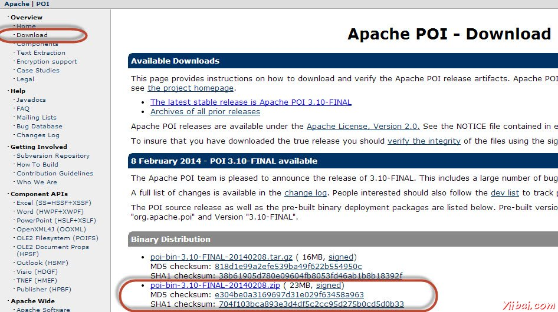
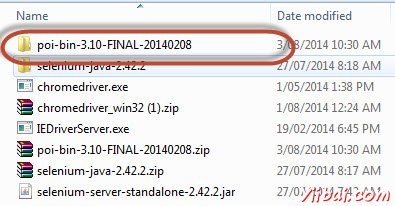
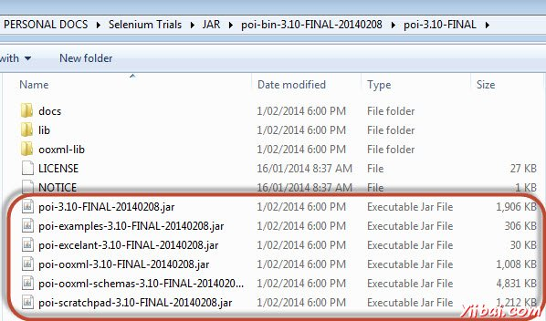
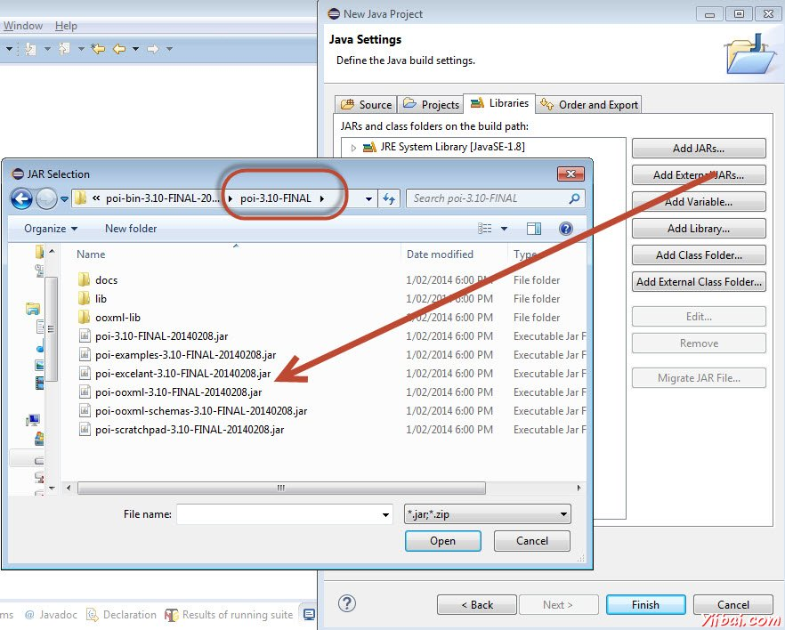
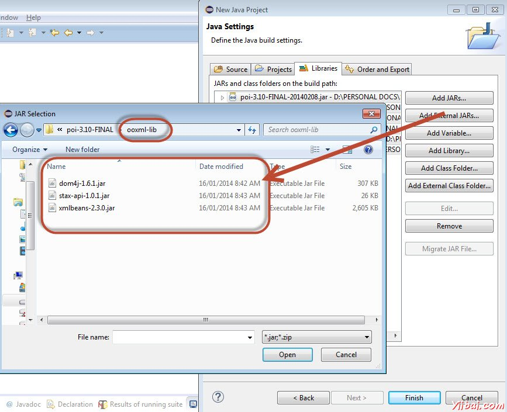
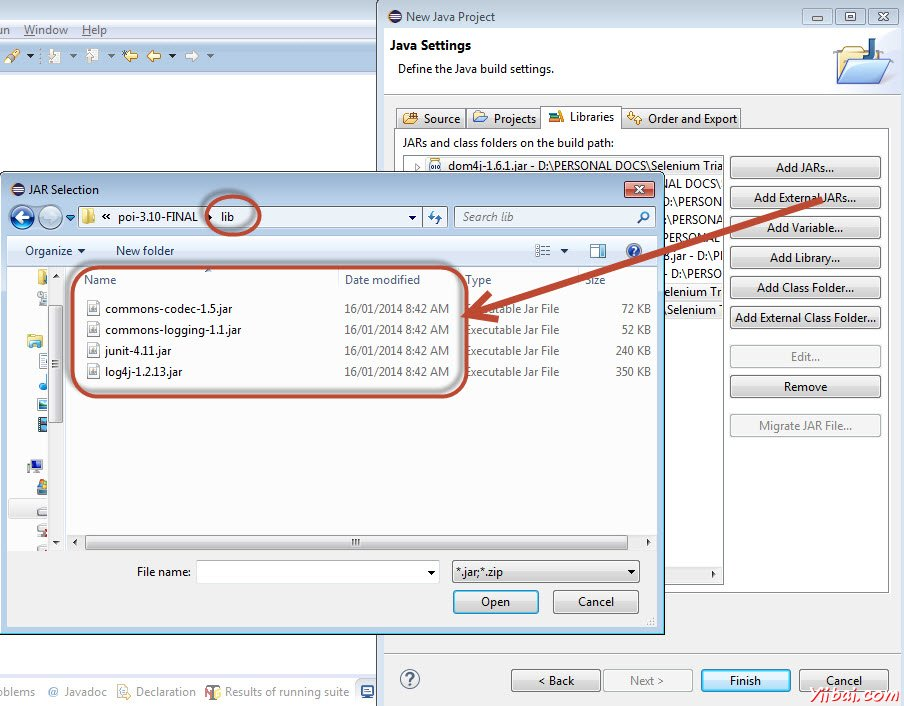
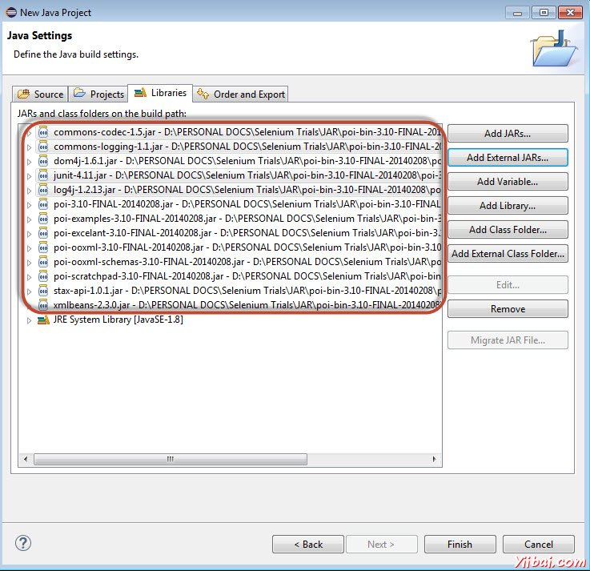
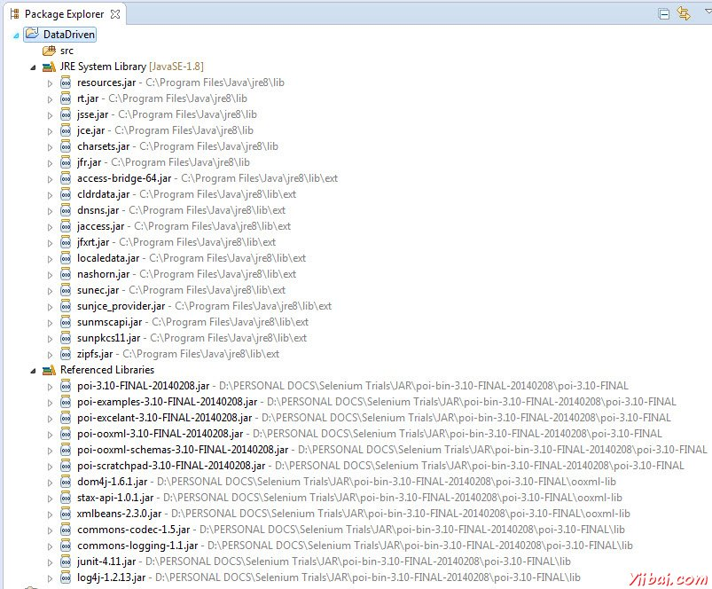
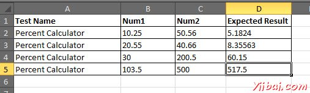
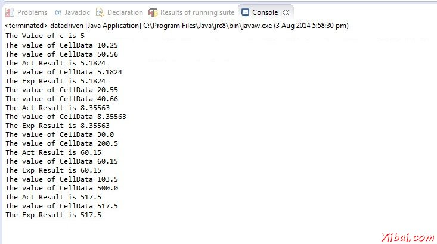

# 使用Excel数据驱动

在设计测试，参数化测试是不可避免的。我们会利用Apache的POI- Excel JAR实现是一样的。它可以帮助我们来读取和写入到Excel中。

## 下载JAR

**第1步：**导航到URL- http://poi.apache.org/download.htmll并下载ZIP格式。



**第2步：**点击镜像链接下载JAR。


**第3步：**解压缩到一个文件夹。



**第4步：**如下所示的解压缩后的内容将被显示。



**第5步：**现在创建一个新的项目，并在“External JARs”添加“POI-3.10.FINAL”文件夹中所有的jar包。



**第6步：**现在，添加所有的“External JARs”在“OOXML-LIB”文件夹中。



**第7步：**现在，添加所有的“External JARs”在“lib”文件夹中。



**第8步：**如下图所示，显示已添加的JAR文件。



**第9步：**如下图所示的Package Explorer显示。此外附加“webdriver”相关的JAR



## 参数

为了演示目的，我们将参数的百分比计算器测试。

**第1步：**我们将所有的参数需要使用Excel的％计算器的输入。所设计的excel如下所示。



**第2步：**现在，我们将执行所有百分比计算器，所有指定的参数。

**第3步：**让我们创建通用的方法来访问使用导入JARS Excel文件。这些方法可以帮助我们获得一个特定的单元格数据或设置一个特定的单元格的数据等。

```java
import java.io.*;
import org.apache.poi.xssf.usermodel.*;
    
public class excelutils 
{
   private XSSFSheet ExcelWSheet;
   private XSSFWorkbook ExcelWBook;

   //Constructor to connect to the Excel with sheetname and Path
   public excelutils(String Path, String SheetName) throws Exception 
   {
	  try 
	  {
	    // Open the Excel file
	    FileInputStream ExcelFile = new FileInputStream(Path);
	    // Access the required test data sheet
	    ExcelWBook = new XSSFWorkbook(ExcelFile);
	    ExcelWSheet = ExcelWBook.getSheet(SheetName);    
	  } 
	  catch (Exception e)
	  {
	    throw (e);           
	  }
   }
              
    //This method is to set the rowcount of the excel.
    public int excel_get_rows() throws Exception 
    {
	  try 
	  {
	     return ExcelWSheet.getPhysicalNumberOfRows();           
	  } 
	  catch (Exception e)
	  {
	  	throw (e);
         
	  }
    }
        

    //This method to get the data and get the value as strings.
    public String getCellDataasstring(int RowNum, int ColNum) throws Exception
    {
	   try
	   {
		   String CellData = ExcelWSheet.getRow(RowNum).getCell(ColNum).getStringCellValue();
		   System.out.println("The value of CellData " + CellData);
		   return CellData;
	   }
	   catch (Exception e)
	   {
	   	 return "Errors in Getting Cell Data";
	   }
    }
    
 
  //This method to get the data and get the value as number.
    public double getCellDataasnumber(int RowNum, int ColNum) throws Exception
    {
	   try
	   {
		  double CellData = ExcelWSheet.getRow(RowNum).getCell(ColNum).getNumericCellValue();
		  System.out.println("The value of CellData " + CellData);
		  return CellData;
		}
		catch (Exception e)
		{
			return 000.00;
		}
    }
}

```

**第4步：**现在，添加它将访问，我们已经开发了Excel的方法，主要的方法。

```java
import java.io.*;
import org.apache.poi.xssf.usermodel.*;
    
public class excelutils 
{
   private XSSFSheet ExcelWSheet;
   private XSSFWorkbook ExcelWBook;

   //Constructor to connect to the Excel with sheetname and Path
   public excelutils(String Path, String SheetName) throws Exception 
   {
	  try 
	  {
		 // Open the Excel file
		 FileInputStream ExcelFile = new FileInputStream(Path);
		 // Access the required test data sheet
		 ExcelWBook = new XSSFWorkbook(ExcelFile);
		 ExcelWSheet = ExcelWBook.getSheet(SheetName);    
	
	   } 
	   catch (Exception e)
	   {
		   throw (e);           
	   }
   }
              
    //This method is to set the rowcount of the excel.
    public int excel_get_rows() throws Exception 
    {
	   try 
	   {
		   return ExcelWSheet.getPhysicalNumberOfRows();           
		} 
		catch (Exception e)
		{
			throw (e);
		
		}
    }
      

    //This method to get the data and get the value as strings.
    public String getCellDataasstring(int RowNum, int ColNum) throws Exception
    {
	   try
	   {
		   String CellData = ExcelWSheet.getRow(RowNum).getCell(ColNum).getStringCellValue();
		  //Cell = ExcelWSheet.getRow(RowNum).getCell(ColNum);
		  //String CellData = Cell.getStringCellValue();
		  System.out.println("The value of CellData " + CellData);
		  return CellData;
		}
		catch (Exception e)
		{
			return "Errors in Getting Cell Data";
		}
    }
    
   //This method to get the data and get the value as number.
    public double getCellDataasnumber(int RowNum, int ColNum) throws Exception
    {
	   try
	   {
		   double CellData = ExcelWSheet.getRow(RowNum).getCell(ColNum).getNumericCellValue();
		  //Cell = ExcelWSheet.getRow(RowNum).getCell(ColNum);
		  //String CellData = Cell.getStringCellValue();
		  System.out.println("The value of CellData " + CellData);
		  return CellData;
		}
		catch (Exception e)
		{
			return 000.00;
		}
    }    
}

```

## 输出

在执行脚本，输出显示在控制台中，如下图所示。

