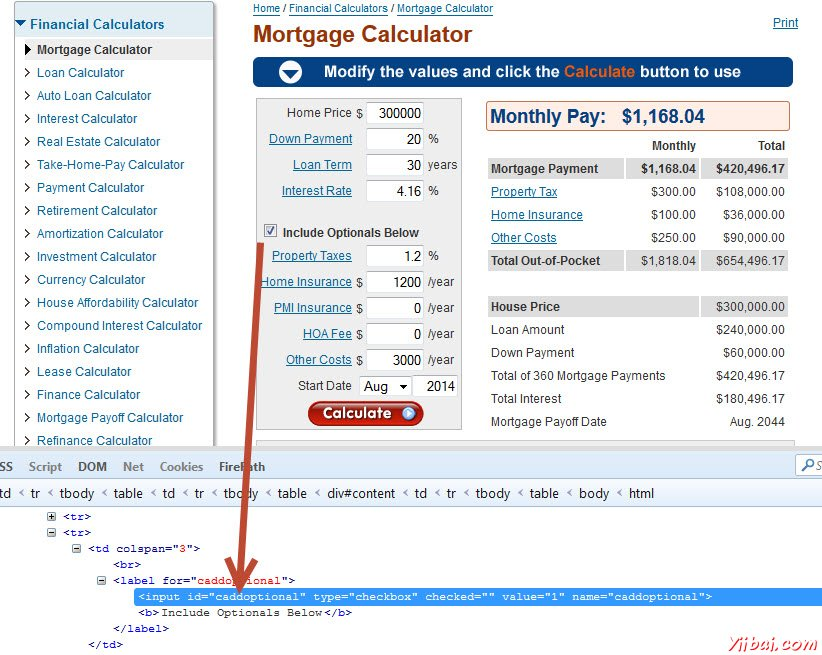
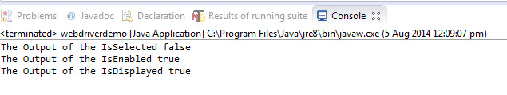

# 复选框交互

在本节中，我们将了解如何与交互复选框。我们可以使用“click”方法选择入住按钮选项，然后取消选择使用相同的“click”方法。

让我们明白，如何使用交互复选框 - http://www.calculator.net/mortgage-calculator.htmll。我们还可以检查是否选择/启用/可见光的复选框。



```java
import java.util.concurrent.TimeUnit;
import org.openqa.selenium.*;
import org.openqa.selenium.firefox.FirefoxDriver;

public class webdriverdemo
{
  public static void main(String[] args) throws InterruptedException
  {
	WebDriver driver = new FirefoxDriver();

	//Puts a Implicit wait, Will wait for 10 seconds before throwing exception
	driver.manage().timeouts().implicitlyWait(10, TimeUnit.SECONDS);


	//Launch website
	driver.navigate().to("http://www.calculator.net/mortgage-calculator.htmll");
	driver.manage().window().maximize();
	 
    // Click on check Box
    driver.findElement(By.id("caddoptional")).click();
    
    System.out.println("The Output of the IsSelected " + driver.findElement(By.id("caddoptional")).isSelected());
    System.out.println("The Output of the IsEnabled " + driver.findElement(By.id("caddoptional")).isEnabled());
    System.out.println("The Output of the IsDisplayed " + driver.findElement(By.id("caddoptional")).isDisplayed());
    
    driver.close(); 
 
   }
} 
```

## 输出

在执行时，该复选框被点击命令后，选中(因为它是默认选中)和命令的输出显示在控制台中。

