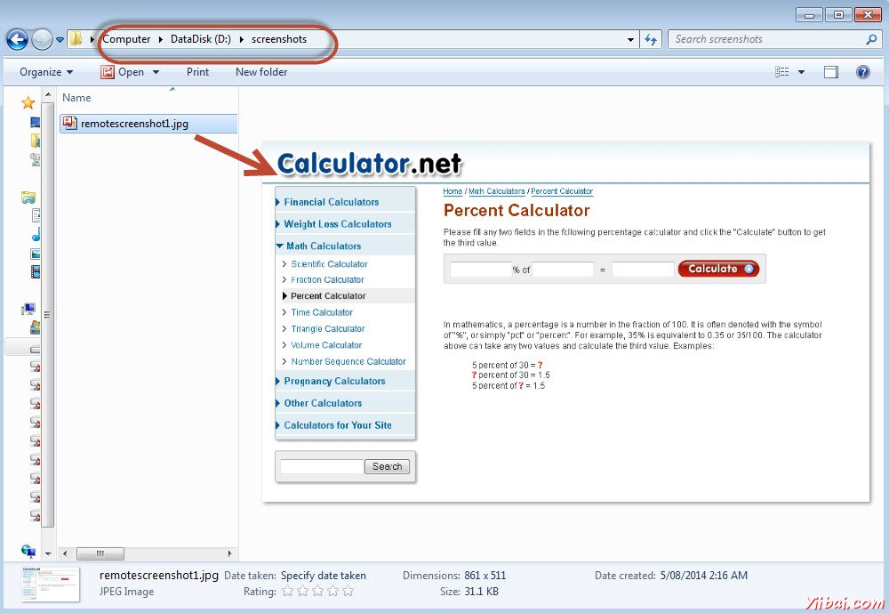

# 捕捉屏幕截图

截图捕获功能可以帮助我们在需要在运行时抓取截图，在特别是当故障发生。随着截图的帮助和日志信息，我们将能够更好地分析结果

截图是本地执行和Selenium 网格(远程)处决配置不同。让我们来看看他们每一个例子

## 本地主机执行

在下面的例子中，我们将计算百分比之后的截图。请确保给一个有效的路径，用以保存屏幕截图。

```java
import java.io.File;
import java.io.IOException;
import java.util.concurrent.TimeUnit;

import org.apache.commons.io.FileUtils;
import org.openqa.selenium.*;
import org.openqa.selenium.firefox.FirefoxDriver;

public class webdriverdemo
{
  public static void main(String[] args) throws IOException
  {
	WebDriver driver = new FirefoxDriver();

    //Puts a Implicit wait, Will wait for 10 seconds before throwing exception
	driver.manage().timeouts().implicitlyWait(10, TimeUnit.SECONDS);

    //Launch website
	driver.navigate().to("http://www.calculator.net/");
	
	//Maximize the browser
	driver.manage().window().maximize();

    // Click on Math Calculators
	driver.findElement(By.xpath(".//*[@id='menu']/div[3]/a")).click();
  
    // Click on Percent Calculators
	driver.findElement(By.xpath(".//*[@id='menu']/div[4]/div[3]/a")).click();

	// Enter value 10 in the first number of the percent Calculator
    driver.findElement(By.id("cpar1")).sendKeys("10");

    // Enter value 50 in the second number of the percent Calculator
    driver.findElement(By.id("cpar2")).sendKeys("50");
    
    // Click Calculate Button
    driver.findElement(By.xpath(".//*[@id='content']/table/tbody/tr/td[2]/input")).click();

    // Get the Result Text based on its xpath
    String result = driver.findElement(By.xpath(".//*[@id='content']/p[2]/span/font/b")).getText();
    
    File screenshot = ((TakesScreenshot)driver).getScreenshotAs(OutputType.FILE);
	
	FileUtils.copyFile(screenshot, new File("D:screenshotsscreenshots1.jpg"));	
	
	//Print a Log In message to the screen
    System.out.println(" The Result is " + result);
    
	//Close the Browser.
    driver.close();    
  }
}

```

### 输出

在执行这个脚本，截图保存在“D:screenshots”文件夹中名为'screenshots1.jpg“，如下图所示。

## Selenium网格- 捕捉屏幕截图

当Selenium网格工作，我们应该确保从远程系统采取正确的截图。我们将充分利用增强的驱动程序。

## 例子

我们将连接到集线器Firefox的节点上执行该脚本。更多关于配置集线器和节点，请参阅Selenium网格章节。

```java
package TestNG;

import org.openqa.selenium.remote.Augmenter;
import org.openqa.selenium.remote.DesiredCapabilities;
import org.openqa.selenium.TakesScreenshot;
import java.util.concurrent.TimeUnit;
import org.openqa.selenium.*;
import org.testng.annotations.AfterTest;
import org.testng.annotations.BeforeTest;
import org.testng.annotations.Parameters;
import org.testng.annotations.Test;
import java.io.File;
import java.net.URL;
import java.net.MalformedURLException;
import org.apache.commons.io.FileUtils;
import org.openqa.selenium.remote.RemoteWebDriver;
import java.io.IOException;

public class TestNGClass 
{
  public WebDriver driver;
  public String URL, Node;
  protected ThreadLocal<RemoteWebDriver> threadDriver = null;
	
  @Parameters("browser")
  @BeforeTest
  public void launchapp(String browser) throws MalformedURLException
  {		
   String URL = "http://www.calculator.net";
   if (browser.equalsIgnoreCase("firefox")) 
   {
	 System.out.println(" Executing on FireFox");
	 String Node = "http://10.112.66.52:5555/wd/hub";
  	 DesiredCapabilities cap = DesiredCapabilities.firefox();
	 cap.setBrowserName("firefox");

	 driver = new RemoteWebDriver(new URL(Node), cap);
	 //Puts a Implicit wait, Will wait for 10 seconds before throwing exception
	 driver.manage().timeouts().implicitlyWait(10, TimeUnit.SECONDS);
		
	 //Launch website
	 driver.navigate().to(URL);	
	 driver.manage().window().maximize();		
   } 
    else 
   {
      throw new IllegalArgumentException("The Browser Type is Undefined");
   }
 }
	 
	
  @Test
  public void calculatepercent() throws IOException
  {
	driver.findElement(By.xpath(".//*[@id='menu']/div[3]/a")).click();     	
	// Click on Math Calculators  
	driver.findElement(By.xpath(".//*[@id='menu']/div[4]/div[3]/a")).click();     
	// Click on Percent Calculators
	
	// Make use of augmented Driver to capture Screenshots.
	WebDriver augmentedDriver = new Augmenter().augment(driver);
    File screenshot = ((TakesScreenshot)augmentedDriver).getScreenshotAs(OutputType.FILE);
    FileUtils.copyFile(screenshot, new File("D:screenshots
emotescreenshot1.jpg"));
	
	// Please note - Screenshot would be saved on the system where the script is executed and NOT on remote machine.
		
    driver.findElement(By.id("cpar1")).sendKeys("10"); 		
    // Enter value 10 in the first number of the percent Calculator
    driver.findElement(By.id("cpar2")).sendKeys("50");		
    // Enter value 50 in the second number of the percent Calculator    
    driver.findElement(By.xpath(".//*[@id='content']/table/tbody/tr/td[2]/input")).click();	    
    // Click Calculate Button
    String result = driver.findElement(By.xpath(".//*[@id='content']/p[2]/span/font/b")).getText();		    
    // Get the Result Text based on its xpath    
    System.out.println(" The Result is " + result);					
    //Print a Log In message to the screen
        
    if(result.equals("5"))
    {
    	System.out.println(" The Result is Pass");
    }
    else
    {
    	System.out.println(" The Result is Fail");
    }		    
  }
  
   @AfterTest
   public void closeBrowser() 
   {
	   driver.quit();	    
   }
}
```

### 输出

当执行该脚本，截图被捕获并储存在指定的位置，如下所示。

